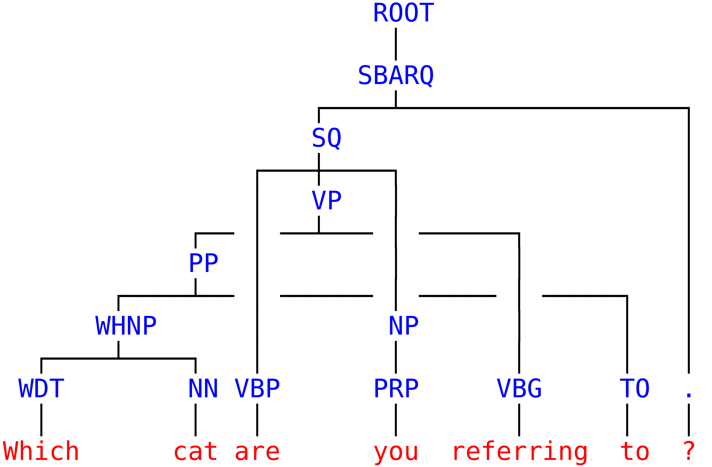

# Mind The Gap

Multilingual discontinuous constituency parsing.

This is the version of the Mind-the-Gap parser used in the following forthcoming article:

**Unlexicalized Transition-based Discontinuous Constituency Parsing**  
Maximin Coavoux, Benoît Crabbé, Shay B. Cohen  
TACL (to appear)  
[[preprint]](https://arxiv.org/abs/1902.08912)  


# Compile

Download headers for Eigen and Boost:

```bash
cd lib
bash get_dependencies.bash
cd ..
```

Compile:

```bash
mkdir bin
cd src
make clean
make wstring
cd ..
```

NB: without `wstring`, strings will be encoded with basic `char` instead
of `wchar_t`, which will confuse the character bi-lstm.


# Parse with pretrained models:

Pretrained models whose results are presented in the paper (Table 4) are in the `pretrained` folder.

Use `sh reparse.sh <path to data folder multilingual_disco_data/data>` to reparse the development set with each model.
The scripts to preprocess and generate the data in the parser input format are in the following repository: 
[https://github.com/mcoavoux/multilingual_disco_data](https://github.com/mcoavoux/multilingual_disco_data).


### Parse a bunch of files

Input data (for each file):

- 1 sentence per line, tokens separated by spaces.
- make sure your the input sentences have the same tokenization as in the training corpora (punctuation, etc)
- parentheses must be replaced by `-LRB-` / `-RRB-`.


Parse example with a projective model:

```bash
cd bin
./mtg2_parser -b 1 -m ../pretrained_models_projective/ml_lex/FRENCH ../data/french/french_sample_wiki*
# -b <beam size> -m <model> [files]+
```

For each file `french_sample_wiki*`, this command will output:
`french_sample_wiki*.discbracket` and `french_sample_wiki*.conll`.
The first one contains predicted constituency trees (1 per line) in discbracket
format (extension of PTB-style bracketed tree).
You can convert them to standard PTB-style trees with [discodop](https://github.com/andreasvc/disco-dop/).
The second file contains conll format dependency trees, including
morphological analyses and dependency labels.

NB: predicted dependency tree evaluation have shown good results 
for French, Hebrew, Korean, Polish, Swedish (languages for which
SPMRL constituency and dependency treebanks have few mismatches, see
[Coavoux and Crabbé, 2017](https://hal.archives-ouvertes.fr/hal-01522313/document), Table 2).

If the model uses a non-lexicalized transition system (`pretrained_models/ml/FRENCH`),
the conll file still contains dependency labels and morphological
analyses, but not dependency trees.

### Parse stdin

Example with a discontinuous English model:

```bash
$ echo "Which cat are you referring to ?" | ./mtg2_parser -m ../pretrained/ml_gap_unlex_eager_oracle/dptb/ -b 1
(ROOT (SBARQ (SQ (VP (PP (WHNP (WDT 0=Which) (NN 1=cat)) (TO 5=to)) (VBG 4=referring)) (VBP 2=are) (NP (PRP 3=you))) (. 6=?)))
```




